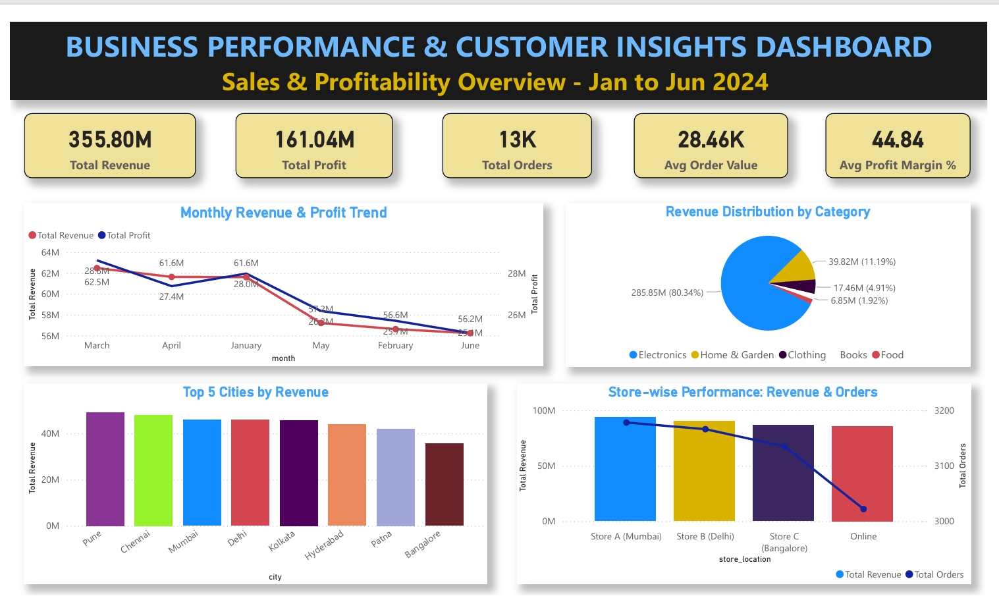
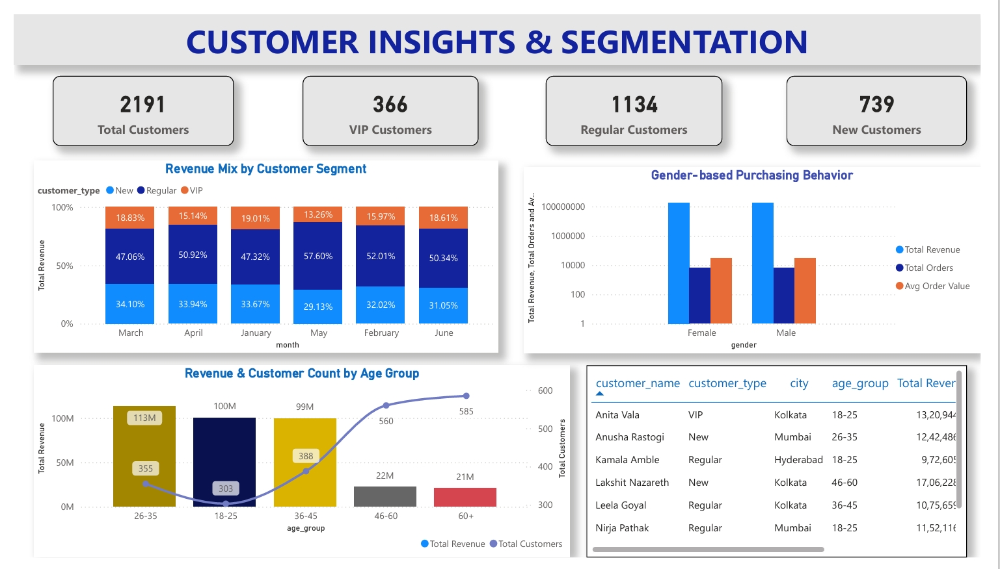

# 📊 Business Performance & Customer Insights Analysis

[](https://www.python.org/downloads/)
[](https://powerbi.microsoft.com/)
[](LICENSE)
[]()

> End-to-end business analytics project analyzing 12,500+ sales transactions to derive actionable insights on customer behavior, product performance, and revenue optimization strategies.



## 🎯 Project Overview

This comprehensive data analytics project examines 6 months of retail sales data (January - June 2024) across multiple channels and product categories. The analysis combines **SQL**, **Python**, **Excel**, and **Power BI** to deliver interactive dashboards and strategic business recommendations.

**Key Highlights:**
- 📈 ₹355.80M revenue analyzed across 12,500+ transactions
- 👥 2,191 unique customers segmented by behavior and demographics
- 🛍️ 400 products across 5 major categories
- 📊 4-page interactive Power BI dashboard with 20+ visualizations
- 💡 96.35% customer retention rate identified

## 🔍 Key Features

### 1. **Comprehensive Data Analysis**
- Multi-table data integration using star schema design
- Statistical analysis of sales patterns and trends
- Customer segmentation (VIP, Regular, New)
- Product performance evaluation across categories

### 2. **Interactive Dashboards**
- **Executive Dashboard**: High-level KPIs and trends
- **Sales Performance**: Deep-dive into revenue, discounts, and payment methods
- **Customer Analytics**: Demographic analysis and behavioral patterns
- **Product Insights**: Category performance and top performers

### 3. **Actionable Insights**
- Identified Electronics as dominant category (80.34% revenue share)
- Discovered exceptional customer retention (96.35%)
- Analyzed discount impact on profitability
- Geographic performance across 8 major Indian cities

## 🛠️ Technologies Used

| Technology | Purpose |
|------------|---------|
| **Python 3.9+** | Data cleaning, EDA, statistical analysis |
| **Pandas & NumPy** | Data manipulation and numerical operations |
| **Matplotlib** | Data visualization and exploratory charts |
| **SQL (PostgreSQL)** | Data extraction and aggregation |
| **Power BI Desktop** | Interactive dashboard development |
| **DAX** | Custom measures and calculated columns |
| **Microsoft Excel** | Initial data validation and pivot analysis |
| **Jupyter Notebook** | Interactive analysis and documentation |

## 📊 Dashboard Previews

### Sales Analysis Dashboard


### Customer Insights


### Product Performance


## 🚀 Getting Started

### Prerequisites
```bash
Python 3.9+
Power BI Desktop
Jupyter Notebook
PostgreSQL (optional)
```


## 📈 Key Findings

### Business Metrics
- **Total Revenue**: ₹355.80 Million
- **Total Profit**: ₹161.04 Million
- **Profit Margin**: 44.84% average
- **Average Order Value**: ₹28,462
- **Total Orders**: 12,500

### Customer Insights
- **Regular Customers**: 50.78% of revenue (highest contribution)
- **VIP Customers**: 16.84% of revenue (highest per-customer value)
- **New Customers**: 32.39% of revenue (growth potential)
- **Retention Rate**: 96.35% (2+ purchases)

### Product Performance
- **Top Category**: Electronics (80.34% revenue share)
- **Top Sub-categories**: Headphones, Smartphones, Tablets
- **Consistent Margins**: 43-46% across all categories

### Geographic Distribution
- **Top Cities**: Pune, Chennai, Mumbai, Delhi (₹45-49M each)
- **Balanced Performance**: All major metros showing strong sales

## 💡 Business Recommendations

Based on the analysis, key strategic recommendations include:

1. **Expand Non-Electronics Categories** - Introduce premium products in Home & Garden, Clothing
2. **VIP Customer Expansion Program** - Convert high-spending Regular customers to VIP
3. **Age-Targeted Marketing** - Focus on 26-35 demographic with highest revenue/capita
4. **Strategic Discount Optimization** - A/B test discount thresholds for volume vs. profitability
5. **Tier-2 City Expansion** - Leverage online channel for geographic growth

## 📝 Analysis Methodology

### Phase 1: Data Collection & Preparation
- Loaded 4 CSV datasets (Sales, Customer, Product, Date)
- Validated data types and checked for missing values
- Verified referential integrity across tables

### Phase 2: Exploratory Data Analysis
- Univariate and bivariate analysis
- Statistical summaries and distributions
- Outlier detection (1,608 high-value transactions flagged)

### Phase 3: Data Modeling
- Designed star schema with Sales as fact table
- Created one-to-many relationships with dimension tables
- Implemented 28+ custom DAX measures

### Phase 4: Dashboard Development
- Built 4-page interactive dashboard
- Implemented 8 synchronized slicers
- Applied consistent formatting and professional design

### Phase 5: Insight Generation
- Identified key patterns and trends
- Formulated actionable business recommendations
- Documented challenges and solutions

## 🎓 Skills Demonstrated

- ✅ Data Cleaning & Validation
- ✅ Exploratory Data Analysis (EDA)
- ✅ Statistical Analysis
- ✅ Data Modeling (Star Schema)
- ✅ SQL Query Optimization
- ✅ DAX Formula Development
- ✅ Interactive Dashboard Design
- ✅ Business Intelligence
- ✅ Data Storytelling
- ✅ Stakeholder Reporting

## 🔮 Future Enhancements

- [ ] Implement predictive models for sales forecasting
- [ ] Add RFM (Recency, Frequency, Monetary) customer segmentation
- [ ] Integrate real-time data refresh
- [ ] Build market basket analysis for product recommendations
- [ ] Develop customer churn prediction model
- [ ] Add sentiment analysis from customer reviews
- [ ] Create mobile-optimized dashboard views


## 📧 Contact

**Satyam Saurabh**
- 📧 Email: satyam2610saurabh@gmail.com
- 💼 LinkedIn: [linkedin.com/in/satyam-saurabh](https://linkedin.com/in/satyam-saurabh)
- 🌐 Portfolio: [your-portfolio-link.com](https://i-satyamsaurabh.github.io/My-Portfolio/)
- 📍 Location: Muzaffarpur, Bihar, India

## 📄 License

This project is licensed under the MIT License - see the [LICENSE](LICENSE) file for details.

## 🙏 Acknowledgments

- Dataset inspired by real-world retail operations
- Dashboard design principles from Power BI best practices
- Statistical methods from data science foundations

---

**⭐ Star this repository if you found it helpful!**

**🔗 Connect with me for data analytics discussions and collaborations!**

---

<p align="center">
  <sub>Built with ❤️ for demonstrating end-to-end data analytics capabilities</sub>
</p>
